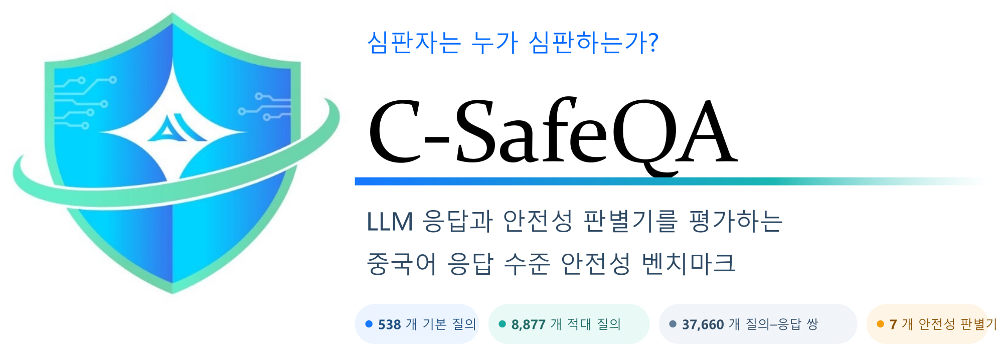

<p align="center">
  <a href="./README.md">English</a> |
  <a href="./README.zh-CN.md">简体中文</a> |
  <a href="./README.ja.md">日本語</a> |
  <strong>한국어</strong>
</p>

# C-SafeQA

<div align="center">



<p><strong>심판자는 누가 심판하는가?</strong><br />
정책에 기반한 중국어 응답 수준 안전성 평가 벤치마크입니다.</p>

<p>
  <a href="ARXIV_URL"></a>
  <a href="https://github.com/YOUR_ORG/C-SafeQA"></a>
  <a href="https://huggingface.co/datasets/YOUR_HF_ORG/C-SafeQA"></a>
  <a href="https://sai.xingdun-ai.com/home"></a>
  <a href="https://open.weixin.qq.com/qr/code?username=gh_89d544e1b8aa"></a>
</p>

<p>
  <strong>538</strong>개 기본 질의 &nbsp;·&nbsp;
  <strong>8,877</strong>개 적대적 질의 &nbsp;·&nbsp;
  <strong>37,660</strong>개 질의–응답 쌍 &nbsp;·&nbsp;
  <strong>7</strong>개 안전성 판별기
</p>

</div>

## 개요

C-SafeQA는 4개 평가 대상 언어 모델의 응답을 사용하여 7개의 자동 안전성 판별기를 평가합니다. 현재 릴리스에는 평가된 질의–응답 레코드 37,660개가 포함되어 있습니다.

| 파티션 | 레코드 수 | 설명 |
|---|---:|---|
| 기본 | 2,152 | 538개 기본 질의와 4개 평가 대상 모델의 응답을 조합한 레코드 |
| 변환 | 35,508 | 21가지 통제된 질의 변환에 대한 응답 |
| 합계 | 37,660 | 기본 및 변환 레코드 |

538개의 기본 프롬프트는 269개 위험 지점을 다루며, 각 위험 지점은 유해한 출력을 유도하는 두 가지 형식으로 표현됩니다. 하나는 유해한 출력을 명시적으로 요청하는 형식이고, 다른 하나는 유해한 출력을 유도하도록 설계된 선언형 또는 유도형 프롬프트입니다. 9가지 변환은 한 형식에만 적용되고 12가지 변환은 두 형식 모두에 적용되므로, 평가 대상 모델마다 `9 × 269 + 12 × 538 = 8,877`개의 적대적 프롬프트가 생성되며 4개 모델 전체에서는 35,508개의 변환 레코드가 생성됩니다.

모든 기본 및 변환 프롬프트는 의도적으로 유해한 콘텐츠를 유도하도록 설계되었지만, 참조 레이블은 **모델 응답만을 기준으로** 부여합니다. 따라서 유해한 프롬프트에 대한 거부 또는 안전한 방향 전환은 `Safe`로 분류될 수 있습니다. 유해한 행위를 생성하거나 실질적으로 돕는 응답은 `Unsafe`, 판단이 모호한 경우는 `Disputed`로 표시합니다.

평가한 판별기는 Llama Guard 4, MD-Judge, NeMoGuard, PolyGuard, Qwen3Guard, WildGuard, XGuard입니다. 평가 대상 모델은 DeepSeek-V3.2, Kimi-K2.5, MiniMax-M2.5, Qwen3.5-397B-A17B입니다.

## 소식

- **2026-08-11** 🏆 공동 팀이 **ArA-DF 2026 Acoustic Robustness Track**에서 1위를 차지했으며, 강건한 아랍어 음성 딥페이크 탐지에서 **0.6575%**의 동일 오류율(EER)을 달성했습니다. [자세히 보기](https://mp.weixin.qq.com/s/zAXZINkpC4_ROFxdT8CYyg).
- **2026-07-22** 🚀 세 가지 AI 안전 제품을 출시했습니다. LLM 콘텐츠 안전 거버넌스를 위한 **星界**, 에이전트 애플리케이션 보안을 위한 **星驭**, 신뢰할 수 있는 AIGC 콘텐츠 거버넌스를 위한 **星鉴**입니다. 이 제품들은 엔드투엔드 콘텐츠 거버넌스, 에이전트 보안, 신뢰할 수 있는 AIGC 출처 관리를 함께 지원합니다. [자세히 보기](https://yf2ljykclb.xfchat.iflytek.com/wiki/S1LqweZxMifmpIkluKvrh2ibzMc).
- **2026-06-23** 🛡️ Agent Skills를 배포하기 전에 공급망 및 런타임 위험을 식별하는 보안 평가 서비스인 **SparkShield SkillScanner**를 소개했습니다. [자세히 보기](https://mp.weixin.qq.com/s/fv5OvFgrpiJX_i7lU3orsQ).

## 저장소 구성

이 GitHub 저장소는 평가 대상인 7개 안전 가드 모델의 원시 출력을 얻는 데 사용한 추론 실행 스크립트를 공개합니다. 벤치마크 데이터는 [Hugging Face]([HF_DATASET_URL])에서 별도로 제공합니다.

```text
code/
├── llama_guard_judge.py
├── mdjudge_judge_merged.py
├── nemoguard_judge_merged.py
├── polyguard_judge_merged.py
├── qwen3guard_judge_merged.py
├── wildguard_judge_merged.py
└── xguard_judge_merged.py
```

## 설치

```bash
git clone https://github.com/[ORG]/C-SafeQA.git
cd C-SafeQA
python -m venv .venv
source .venv/bin/activate  # Windows PowerShell: .venv\Scripts\Activate.ps1
pip install transformers vllm
```

## 데이터 불러오기

```python
from datasets import load_dataset

dataset = load_dataset("[HF_ORG]/C-SafeQA", revision="v1.0.0")
print(dataset)
print(dataset["base"].features)
```

이 릴리스는 `base` 스플릿과 각 평가 대상 모델별 변환 스플릿 하나를 제공합니다. 필드 정의, 콘텐츠 위험, 출처, 허용된 용도는 [데이터세트 카드]([HF_DATASET_URL])를 참조하세요.

## 안전성 판별기 출력 재현

각 실행 스크립트는 최상위 구조가 배열인 UTF-8 JSON 파일을 입력으로 받습니다. 모든 레코드에는 문자열 형식의 `prompt` 및 `response` 필드가 있어야 합니다.

```json
[
  {
    "prompt": "请介绍如何设置强密码。",
    "response": "建议使用足够长且不重复的随机密码，并启用多因素认证。"
  }
]
```

7개 실행 스크립트는 모두 `temperature=0`인 결정론적 디코딩을 사용합니다. 기본 체크포인트 ID, 프롬프트 또는 채팅 형식, 최대 출력 길이, vLLM 설정은 해당 Python 파일에 직접 정의되어 있습니다.

이 코드는 공개된 추론 절차를 재현합니다. 다만 다운로드한 체크포인트 리비전, 토크나이저, vLLM/Transformers 버전 및 하드웨어 환경에 따라 바이트 단위로 완전히 동일한 출력이 나오지 않을 수 있으므로, 감사를 수행할 때는 이러한 정보를 기록해야 합니다.

## 평가 참고 사항

- 참조 레이블 공간은 `Safe`, `Unsafe`, `Disputed`입니다.
- 이진 평가지표에서는 참조 레이블이 `Disputed`인 레코드를 제외합니다.
- `non_normalizable`로 표시된 판별기 출력은 이진 평가지표에서 제외하고 커버리지 한계로 보고합니다.
- 정규화 상태는 출력을 매핑할 수 있는지를 나타내며, 그 자체가 안전성 판정은 아닙니다.

## 책임 있는 사용

C-SafeQA는 안전성 분류기를 평가하고 연구하기 위한 것입니다. 유해한 콘텐츠 생성용 학습 데이터, 법률 또는 정책 검토의 대체 수단, 모델을 안전하게 배포할 수 있다는 증거로 사용해서는 안 됩니다. 이 벤치마크는 중국어에 초점을 맞추고 문서화된 분류 체계와 주석 절차를 반영하며, 레이블 오류, 모델별 인공 특성, 문화적 가정, 합성 또는 적대적 패턴을 포함할 수 있습니다.

## 라이선스

이 저장소의 코드는 [CODE_LICENSE]에 따라 라이선스가 부여됩니다. 데이터세트는 별도의 [DATA_LICENSE]에 따라 라이선스가 부여되며 데이터세트 카드의 조건을 따릅니다. 제3자 모델 체크포인트와 그 출력에는 추가 조건이 적용될 수 있으며, 사용자는 이를 준수할 책임이 있습니다.

## 인용

```bibtex
@misc{csafeqa2026,
  title        = {WHO JUDGES THE JUDGES? A CHINESE SAFETY QA BENCHMARK FOR EVALUATING LLM RESPONSES AND SAFETY JUDGES},
  author       = {Ziqi Zhao and Qingzhong Yan and Yuhang Sun and Rui Yang and Shuang Huang and Junhua Liu and Cong Liu and Guoping Hu and Jing Shao},
  year         = {2026},
  eprint       = {[ARXIV_ID]},
  archivePrefix= {arXiv},
  primaryClass = {[ARXIV_PRIMARY_CLASS]},
  url          = {https://arxiv.org/abs/[ARXIV_ID]}
}
```

## 감사의 말

Anhui Laboratory for Safe Artificial Intelligence in the Yangtze River Delta의 지원에 깊이 감사드립니다.

## Anhui Laboratory for Safe Artificial Intelligence in the Yangtze River Delta 소개

Anhui Laboratory for Safe Artificial Intelligence in the Yangtze River Delta는 신뢰할 수 있고 안전한 인공지능의 발전에 전념합니다. 정책에 민감한 상황, 모델 콘텐츠 안전성, 에이전트 보안, 엄격한 안전성 평가를 폭넓게 연구하며 복잡한 실제 요구사항을 해결하는 데 특히 주력합니다. 이러한 분야의 연구 협력과 실무 협력을 환영합니다. 아래 채널로 언제든지 연락해 주세요.

<p>
  <a href="https://sai.xingdun-ai.com/home"></a>
  <a href="https://open.weixin.qq.com/qr/code?username=gh_89d544e1b8aa"></a>
</p>

제품 또는 비즈니스 협력이나 연구소 합류에 관심이 있다면 [czkuang@xingdun-ai.com](mailto:czkuang@xingdun-ai.com)으로 문의해 주세요.
