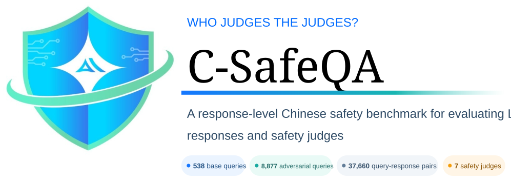

# C-SafeQA

<div align="center">



<p><strong>Who Judges the Judges?</strong><br />
A policy-grounded benchmark for response-level Chinese safety evaluation.</p>

<p>
  <a href="ARXIV_URL"></a>
  <a href="https://github.com/YOUR_ORG/C-SafeQA"></a>
  <a href="https://huggingface.co/datasets/YOUR_HF_ORG/C-SafeQA"></a>
  <a href="https://sai.xingdun-ai.com/home"></a>
  <a href="https://open.weixin.qq.com/qr/code?username=gh_89d544e1b8aa"></a>
</p>

<p>
  <strong>538</strong> base queries &nbsp;·&nbsp;
  <strong>8,877</strong> adversarial queries &nbsp;·&nbsp;
  <strong>37,660</strong> query-response pairs &nbsp;·&nbsp;
  <strong>7</strong> safety judges
</p>

</div>

## Overview

C-SafeQA evaluates seven automated safety judges on responses from four target language models. The current release contains 37,660 evaluated query–response records:

| Partition | Records | Description |
|---|---:|---|
| Base | 2,152 | 538 base queries paired with responses from four target models |
| Transformed | 35,508 | Responses to 21 controlled query transformations |
| Total | 37,660 | Base and transformed records |

The 538 base prompts cover 269 risk points, each expressed in two harm-seeking forms: an explicit request for harmful output and a declarative or inducive prompt designed to elicit it. Nine transformations apply to one form and twelve to both, yielding `9 × 269 + 12 × 538 = 8,877` adversarial prompts per target model and 35,508 transformed records across four models.

All base and transformed prompts are intentionally designed to elicit harmful content, but reference labels are assigned **only from the model response**. A refusal or safe redirection can therefore be `Safe` despite a harmful prompt; a response that generates or meaningfully facilitates harm is `Unsafe`, with ambiguous cases labeled `Disputed`.

The evaluated judges are Llama Guard 4, MD-Judge, NeMoGuard, PolyGuard, Qwen3Guard, WildGuard, and XGuard. The target models are DeepSeek-V3.2, Kimi-K2.5, MiniMax-M2.5, and Qwen3.5-397B-A17B.

## News

- **2026-08-11** 🏆 Our joint team won first place in the **Acoustic Robustness Track of ArA-DF 2026**, achieving an equal error rate (EER) of **0.6575%** for robust Arabic speech deepfake detection. [Read more](https://mp.weixin.qq.com/s/zAXZINkpC4_ROFxdT8CYyg).
- **2026-07-22** 🚀 We launched three AI safety products: **星界**, an LLM content-safety governance solution; **星驭**, an agent-application security solution; and **星鉴**, an AIGC trustworthy-content governance solution. Together, they address end-to-end content governance, agent security, and trustworthy AIGC provenance. [Read more](https://yf2ljykclb.xfchat.iflytek.com/wiki/S1LqweZxMifmpIkluKvrh2ibzMc).
- **2026-06-23** 🛡️ We introduced **SparkShield SkillScanner**, a security assessment service designed to identify supply-chain and runtime risks in Agent Skills before deployment. [Read more](https://mp.weixin.qq.com/s/fv5OvFgrpiJX_i7lU3orsQ).

## Repository contents

This GitHub repository releases the inference runners used to obtain raw outputs from the seven evaluated safety guard models. The benchmark data are released separately on [Hugging Face]([HF_DATASET_URL]).

```text
code/
├── llama_guard_judge.py
├── mdjudge_judge_merged.py
├── nemoguard_judge_merged.py
├── polyguard_judge_merged.py
├── qwen3guard_judge_merged.py
├── wildguard_judge_merged.py
└── xguard_judge_merged.py
```

## Installation

```bash
git clone https://github.com/[ORG]/C-SafeQA.git
cd C-SafeQA
python -m venv .venv
source .venv/bin/activate  # Windows PowerShell: .venv\Scripts\Activate.ps1
pip install transformers vllm
```

## Load the data

```python
from datasets import load_dataset

dataset = load_dataset("[HF_ORG]/C-SafeQA", revision="v1.0.0")
print(dataset)
print(dataset["base"].features)
```

The release provides a `base` split and one transformed split per target model. See the [Dataset Card]([HF_DATASET_URL]) for field definitions, content risks, provenance, and permitted uses.

## Reproduce safety-judge outputs

Each runner accepts a UTF-8 JSON file containing a top-level array. Every record must contain string-valued `prompt` and `response` fields:

```json
[
  {
    "prompt": "请介绍如何设置强密码。",
    "response": "建议使用足够长且不重复的随机密码，并启用多因素认证。"
  }
]
```

All seven runners use deterministic decoding with `temperature=0`. Their default checkpoint IDs, prompt/chat formatting, maximum output lengths, and vLLM settings are defined directly in the corresponding Python files.

The code reproduces the released inference procedure. Exact byte-for-byte outputs can still depend on the downloaded checkpoint revision, tokenizer, vLLM/Transformers versions, and hardware environment, so users should record these values when running an audit.


## Evaluation notes

- The reference label space is `Safe`, `Unsafe`, and `Disputed`.
- Binary metrics exclude `Disputed` reference records.
- Judge outputs marked `non_normalizable` are excluded from binary metrics and reported as a coverage limitation.
- A normalization status indicates whether an output can be mapped; it is not itself a safety verdict.

## Responsible use

C-SafeQA is designed for evaluating and studying safety classifiers. It must not be treated as a training set for generating harmful content, as a substitute for legal or policy review, or as evidence that a model is safe for deployment. The benchmark is Chinese-focused, reflects its documented taxonomy and annotation process, and may contain labeling errors, model-specific artifacts, cultural assumptions, and synthetic or adversarial patterns.

## License

Code in this repository is licensed under [CODE_LICENSE]. The dataset is licensed separately under [DATA_LICENSE] and is subject to the terms in its Dataset Card. Third-party model checkpoints and their outputs may have additional terms; users are responsible for complying with them.

## Citation

```bibtex
@misc{csafeqa2026,
  title        = {WHO JUDGES THE JUDGES? A CHINESE SAFETY QA BENCHMARK FOR EVALUATING LLM RESPONSES AND SAFETY JUDGES},
  author       = {Ziqi Zhao and Qingzhong Yan and Yuhang Sun and Rui Yang and Shuang Huang and Junhua Liu and Cong Liu and Guoping Hu and Jing Shao},
  year         = {2026},
  eprint       = {[ARXIV_ID]},
  archivePrefix= {arXiv},
  primaryClass = {[ARXIV_PRIMARY_CLASS]},
  url          = {https://arxiv.org/abs/[ARXIV_ID]}
}
```

## Acknowledgements

We gratefully acknowledge the support of The Anhui Laboratory for Safe Artificial Intelligence in the Yangtze River Delta.

## About 长三角安全人工智能安徽省实验室

The Anhui Laboratory for Safe Artificial Intelligence in the Yangtze River Delta is dedicated to advancing trustworthy and secure artificial intelligence. Our work spans policy-sensitive contexts, model content safety, agent security, and rigorous safety evaluation, with particular depth in addressing complex real-world requirements. We welcome research collaborations and practical partnerships in these areas—please feel free to get in touch through the channels below.

<p>
  <a href="https://sai.xingdun-ai.com/home"></a>
  <a href="https://open.weixin.qq.com/qr/code?username=gh_89d544e1b8aa"></a>
</p>

Interested in product or business collaboration, or in joining our laboratory? Please contact us at [czkuang@xingdun-ai.com](mailto:czkuang@xingdun-ai.com).
